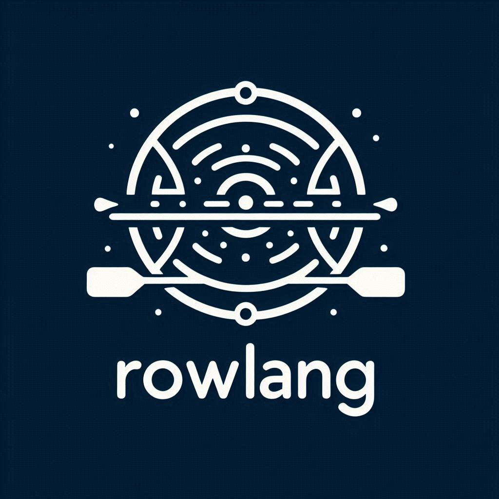

## Technical Description of RowLang

RowLang is an esoteric programming language designed for symbolic computation, inspired by the dynamics of rowing.  
It offers a minimalistic syntax, combining memory manipulation with the metaphorical representation of rowing actions.  
RowLang programs are composed of commands, loops and stroke rate adjustments providing a unique perspective on algorithmic expression.  

## Syntax and Semantics

- **Commands:** RowLang commands correspond to rowing maneuvers and memory operations:
  - `P`: Pull - Move the memory pointer to the right.
  - `R`: Recover - Move the memory pointer to the left.
  - `S`: Stroke - Increment the byte at the current memory cell.
  - `B`: Bow - Decrement the byte at the current memory cell.
  - `.`: Catch - Output the byte at the current memory cell as a character.
  - `,`: Release - Input a character and store its ASCII value in the current memory cell.
  Commands can be followed by an integer that represents the number of repetitions of that command (if omitted it's 1).
- **Loops:** RowLang supports loop constructs enclosed within `[...]`, facilitating repetitive execution of commands until the value of the current memory cell becomes zero.
- **Stroke Rate Adjustment:** The `^` and `v` commands allow for dynamic adjustment of the stroke rate, regulating the speed of program execution to simulate changes in rowing pacing.
- **Coaching:** Any text excluded from the commands, loops and stroke rate adjustments will be interpreted as comments. Therefore avoid the use of punctuation (in particular dots and commas), square brackets as well as the set of characters P, R, S, B and v, which can be used using their opposite lower/upper case form.

## Implementation of the compiler

- **Lexer and Parser:** Lexical analysis and parsing techniques to translate source code into a structured representation.
- **Code Generation:** RowLang programs are translated from their parsed representation into executable C code. This process involves mapping RowLang commands and constructs to equivalent machine instructions or function calls.
- **Optimization:** Optimization techniques to enhance the efficiency and performance of generated code: loop unrolling, constant folding, and dead code elimination.
- **Execution:** After the RowLang program is translated into executable C code, you can use a compiler (like gcc) to consecutively execute it.

## Structure of the compiler

- **Items and libraries:** Including basic C libraries and defining three fundamental items: a constant TAPE_SIZE (representing the maximum memory read, currently set to 30kbyte) and two variables (stroke_delay - representing the stroke rate, i.e. the speed of execution of the program - and loop_depth - representing the depth of loops, helping with formatting and error checking).
- **Definition of token types and token representation:** Two structs one representing the different token types [PULL,RECOVER, STROKE, BOW, CATCH, RELEASE, LOOP_START, LOOP_END, STROKE_RATE_INC, STROKE_RATE_DEC, END_OF_FILE, NEW_LINE, ERROR] and one for the token representation (the token itself plus its possible repetitions).
- **Main function to compile RowLang source code:** Main function implementing the translating logic to compile the RowLang source code into C code.
- **Additional functions:** Three functions:
1. Function reading the character and assigning to the token its type its repetitions [Token nextToken(FILE *)].
2. Function emitting the C code based on the type of the token [void emitCode(Token)].
3. Formatter [void formatter(void)].

## Procedure to use the compiler
You can use any C compiler, using gcc:
- **Compile the RowLang Compiler:** gcc -o rlc rlc.c
- **Compile the RowLang source code:** ./rlc row/example.row > c/example.c
- **Compile the generated C code:** gcc -o exec/example c/example.c
- **Execute the compiled program** ./exec/example

## Applications and Use Cases

- **Education and Exploration:** Educational tool for introducing programming concepts in a playful and engaging manner using a metaphorical approach to visualize algorithms as sequences of rowing actions.
- **Artistic Expression:** As an esoteric programming language, it appeals to enthusiasts interested in creative coding and algorithmic art. 
- **Algorithmic Challenges:** Its simplicity and metaphorical abstraction provide a platform for exploring computational concepts in unconventional ways.

## Contribution
Feel free to contribute or to add new examples to the project!
